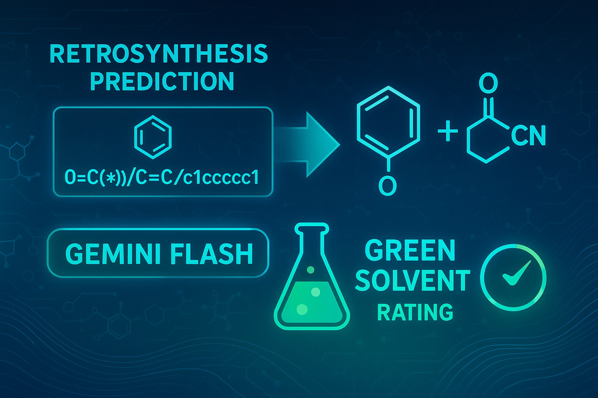

<h1 align="center">
🧪 RetroGSF
</h1>

<br>


**RetroGSF** is a retrosynthesis tool that, from a SMILES input, identifies the chemical reactions necessary for the synthesis of a compound. It then suggests appropriate solvents using Gemini and ranks them based on five key criteria:

- 🔍 Structural similarity
- 🌱 Environmental impact
- 🩺 Health impact
- ⚠️ Safety
- ⭐ Overall score

## 👥 Authors

- Diego Meraldi  
- Witek Huguenin-Dezot  
- Léa Lombard

## 🚀 Features

- 🔬 Retrosynthesis from SMILES using **AiZynthFinder**
- 💡 Intelligent solvent suggestion via **Gemini**
- 🧮 Multi-criteria solvent ranking system
- 📊 Clear output with ranking scores across five dimensions


## 👩‍💻 Installation

For first time users, you will need to create a new environment. A virtual environment can be installed with anaconda as follow:

```
conda create -n retrogsf python=3.10
conda activate retrogsf
```
(you may also give the environment a different name)

### Installing from the Source:
```
git clone https://github.com/dd-mm17/RetroGSF.git
cd RetroGSF
pip install .
```

## Additional installations
In order to use the Streamlit applet you will need to have an Aizynthfinder config.yml file along with a Google AI Studios API keys.

### 🗂️ config.yml file
The config.yml file can be created using (where ```my_folder``` is the folder that you want download to): 
```
download_public_data my_folder
```

More information can be found found here: [Documentation](https://molecularai.github.io/aizynthfinder/#) or here [GithHub](https://github.com/MolecularAI/aizynthfinder?tab=readme-ov-file)

In order to hardcode the path to your config.yml file, you will need to be updated in the code in the applet.py script at the marked location. Moreover, an example config.yml file is provided in the 'data' folder.


### 🔑 Google API key

1.) Open the following link : (https://aistudio.google.com/app/apikey)

2.) Click on "Get API key"

3.) Create a .env file in the root folder with the following text : ```GEMINI_API_KEY="YOUR_API_KEY"```


## 🔥 Usage
### 📱 Running the Streamlit App

To run the Streamlit app:

1. Navigate to the `app` directory:

   ```bash
   cd app
   ```

2. In the terminal, run the following command to start the Streamlit app:

   ```bash
    streamlit run applet.py
   ```

## ⚙️ Run tests and coverage
To ensure the functionality of the project and check for any issues, you can run tests and check the test coverage. Follow these steps:

```
(conda_env) $ pip install tox
(conda_env) $ tox
```

## 📖 License
This project is licensed under the MIT License. You are free to use, modify, and distribute this software under the terms described in the [LICENSE](./LICENSE) file.

For the full legal text, see the [LICENSE](./LICENSE) file in this repository.


