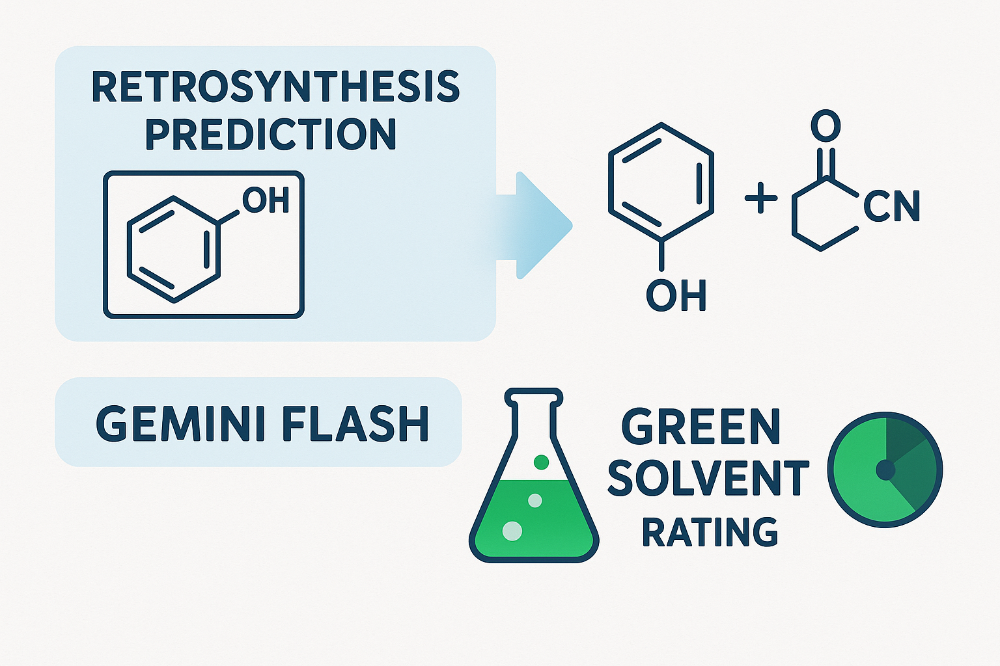

<h1 align="center">
RetroGSF
</h1>

<br>


Predict and evaluates a solvent for a retrosynthesized reaction.

## 👩‍💻 Installation

For first time users, you will need to create a new environment. A virtual environment can be installed with anaconda as follow:

```
conda create -n retrogsf python=3.10
conda activate retrogsf
```
(you may also give the environment a different name)

### 1. Install with pypi:
```
conda activate retrogsf
(conda_env) $ pip install retrogsf
```

### 2. Installing from the Source:
```
git clone https://github.com/dd-mm17/RetroGSF.git
cd RetroGSF
pip install .
```

## Additional installations
In order to use the streamlit applet you will need to have an Aizynthfinder config.yml file along with a Google AI Studios API keys.

### config.yml file
The config.yml file can be created using (where ```my_folder``` is the folder that you want download to): 
```
download_public_data my_folder
```

More information can be found found here: [Documentation](https://molecularai.github.io/aizynthfinder/#) or here [GithHub](https://github.com/MolecularAI/aizynthfinder?tab=readme-ov-file)

The path to your config.yml file will need to be updated in the code at the following areas:


### Google API key

1.) Open the following link : (https://aistudio.google.com/app/apikey)

2.) Click on "Get API key"

3.) Create a .env file in the root folder with the following text : ```GEMINI_API_KEY="YOUR_API_KEY"```


## 🔥 Usage
To run the streamlit applet you will need to cd 

cd to git repository, open terminal and run ```streamlit run app.py```


## 🛠️ Development installation


### Run tests and coverage

```
(conda_env) $ pip install tox
(conda_env) $ tox
```


